## Тавдинское местописание

Валерий ЕРМОЛАЕВ — автор поэтических книг, его стихи вошли в «Антологию цеха поэтов», изданную в 1995 году в Екатеринбурге; он искусствовед — закончил Академию художеств в Санкт-Петербурге и многие годы изучает народное деревянное зодчество Зауралья, а в родной Тавде известен ещё и как автор краеведческих очерков.
***
Тавдинский район Свердловской области расположен в среднем течении реки Тавды, притока Тобола, в лесном Зауралье, на западной окраине одной из самых обширных низменностей земного шара — Западно-Сибирской равнины. Левобережная половина территории района входит в восточную провинцию Кондинской низменности, а правобережная — междуречье Тавды и Туры — захватывает часть Зауральской наклонной равнины.

Район занимает площадь 6539 квадратных километров, из них около 3100 — леса, 2500 — болота, 175 — озера и реки, 442 — сельскохозяйственные угодья. Центр района город Тавда расположен в 360 километрах к востоку от Екатеринбурга и в 125 километрах к северу от Тюмени. Географические координаты его: 65 градусов 16 минут восточной долготы и 58 градусов 03 минуты северной широты. Город занимает площадь в 160 квадратных километров, из них 45 под застройкой.

Протяженность района в широтном направлении 93 километра, в меридиальном — 110. Занимая крайне восточное положение в области, он граничит на севере с Таборинским, на западе с Туринским, на юго-западе с Слободо-Туринским районами. С северо-востока примыкают Кондинский, с востока — Тобольский, с юга — Нижне-Тавдинский районы Тюменской области.

После присоединения Сибири к Руси с конца 16 века тавдинские земли входили в состав Пелымского воеводства, затем Тобольского, а с учреждением губерний в 1708 году — в Кошукскую волость Туринского уезда Сибирской губернии, с 1796 года ставшей Тобольской, в свою очередь переименованной в августе 1919 года в Тюменскую. В ноябре 1923 года образованный район с центром в посёлке Тавда в составе Ирбитского округа Уральской области, при разделении которой в январе 1934 года Верхне-Тавдинский район отнесён к Обь-Иртышской области, вскоре переименованной в Омскую. В октябре 1938 года Тавдинский район отошёл к Свердловской области.

### Поверхность

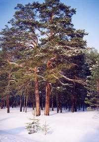

Современный рельеф определён геологической историей Земли. Около 165 миллионов лет назад в мезозойскую эру складчатые горные структуры Западно-Сибирской плиты, возникшие ещё в более древнею палеозойскую эру, испытали опускание и были покрыты водами мирового океана. Такие опускания сменялись подъёмами неоднократно на протяжении более близкой к нам по времени кайнозойской эры, пока 30 миллионов лет назад тектоническая плита окончательно приподнялась, а морские воды отступили. Мощный слой осадочных пород, достигающий более тысячи метров, послужили фундаментом плоскоравнинного рельефа Западной Сибири. Самые верхний горизонтальные отложения образованы рыхлыми осадками озёр и рек в современную послеледниковую эпоху.

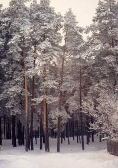

Тавдинскую землю по особенностям рельефа можно разделить на три района. Правобережье, несколько приподнято над восточным левобережьем, является обширной слабо расчленённой ареной речных террас, обычно плавно или уступами переходящих в коренной берег — междуречье Тавды и Туры. Первые надпойменные террасы здесь низкие, до 10 метров, шириной не более одного километра. Вторые наиболее ярко выражены, достигают высоты 40-50 метров и часто обрываются к Тавде высокими обрывами — ярами. Древняя долина реки представляет собой гряды и острова песчаных увалов, высотой 5-12 метров, с довольно плоскими вершинами и пологими склонами. Абсолютные высоты над уровнем моря здесь равны 100-115 метров. Ложбины древних водостоков ориентированы вдоль Тавды, с северо-запада на юго-восток. Современные же её притоки прорезали узкие долины в широтном направлении. Вершины увалов, замкнутые котловины, другие западины и понижение рельефа заняты болотами и озёрами. Приречные части террас расчленены оврагами, логами, древними и современными. Благодаря равнинности и облесенности рельефа, овражная эрозия редка и наблюдается лишь у деревни Саитково.

Строение чехла морских континентальных отложений правобережного района особенно наглядно наблюдается в приречных обнажениях пород — на ярах у деревень Васьково, Саитково, Белоярка. Остатки флоры и фауны в породах рассказывают как о более тёплых климатических эпохах в истории земли, так и об оледенении, которое наступило 100-200 тысяч лет назад и достигало Тавды. Именно от ледникового периода дошли до нас бивни и кости древнего мамонта, найденные в речном обрыве возле Васьково.

Левобережье, ориентировочно ограниченное цепью озёр Большое Сатыково, Шайтанское, Большая Индра, представляются более плоской равниной с абсолютными высотами в 60-80 метров. Здесь низкие, слабо дренированные надпойменные террасы. Широкие полосы островов и пологих увалов перемежаются заболоченными пространствами. Вторые надпойменные террасы встречаются редко и образуют песчаные валы высотой 12-15 метров, хорошо наблюдаемые у деревни Хмелёвка и озера Янычкова. Рельеф нарушен неглубокими ложбинами и логами. Среди болот часты «гривы» — продолговатые песчаные гряды высотой от 3 до 10 метров, проросшие лесом и, в большинстве своём, ориентированные вдоль русла Тавды, из чего можно предположить, что это остатки древних прирусловых валов.

Третий Тавдинско-Куминский междуречный район охватывает 20-30 километровую полосу плоских увалов, ограниченную на северо-востоке поясом верховых водораздельных болот. Вытянутые холмистые повышения увалов и грив, чередующиеся с котловинами и продолговатыми ложбинами, создают сложные сочетания рельефа, благодаря чему он не производит впечатления однообразия и монотонности.

Минеральные ресурсы района определены его геологическим прошлым и представлены промышленными запасами песка, глины, торфа. ПЕСОК добывается по всей территории по мере надобности при прокладке дорог, сооружении дамб, для промышленного и жилого строительства. Значительные месторождения ГЛИНЫ, одно из которых — у посёлка Фабрика — входит в государственные фонд и разрабатывалось местным кирпичным заводом многие десятилетия. Месторождение «белой глины» — МЕРГЕЛЯ возле села Кошуки известно с давних пор: местные жители использовали её для побелки. Тавдинская белая глина расходилась вокруг на десятки вёрст. В 1934 году Тюменская геологоразведочная партия подтвердило месторождение с запасами известняковой глины в 40-45 тысяч тонн и залеганием её на глубине от 2,8 до 5,5 метра. Известны выходы на поверхность ГРАВИЯ, например, в 5 километрах на запад от деревни Малиновка на площади в 5 гектаров, пригодного как строительный материал. В береговых ярах Тавды, например, у деревни Васьково, есть выход БОКСИТОВ.

Сохранились сведения о находках в 1930-х годах ЗОЛОТА в верховье Карабашки и на землях Крутинского сельсовета. Тогда же геологом Кукарцевым на речке Белой обнаружены признаки НЕФТИ, а электроразведочная партия Лущанова подтвердила нефтяные залежи на площади в 15 квадратных километров. Перспектива открытия нефтяного месторождения в бассейне Тавды поддерживается современными научными данными.

Притавдинье входит в Западно-Сибирский артезианский бассейн, один из крупнейших в мире. В 1959 году при бурении глубокой скважины на нефть в трёх километрах южнее города была вскрыта йодно-бромная хлоридо-натриевая термальная МИНЕРАЛШЬНАЯ ВОДА. С 1961 года она применяется в бальнеологических целях в местной водолечебнице, а с весны 1994 года налажен её промышленный разлив и продажа в уральском регионе.

По своим целебным свойствам тавдинская вода сравнима со знаменитой «Боржоми» и помогает при лечении заболеваний печени, желчевыводящих путей, опорно-двигательного аппарата.

В районе также пробурено и обустроено около 30 скважин, дающих пресную воду, пригодную для питья.

Тавдинские болота богаты месторождениями ТОРФА. В последние годы разрабатываются болота Шабалино, Михайловское, Вентино, Подъельничное, Перейма и другие. Разрабатываемые площади занимают более 30 гектаров, запасы торфа в них составляют 13 миллионов тонн. Ещё десятки торфяников ждут своего часа. Торфяные слои залегают на глубине от одного до четырёх метров, а мощность их достигает шести метров. Преобладает торф слабого разложения, мало пригодный как топливо, но являющийся ценным удобрением.

### Климат

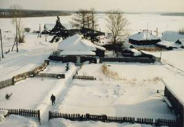

Тавда находится в зоне резко континентального климата, где зима продолжительная, многоснежная и суровая, а лето короткое влажное и умеренно-тёплое. Формирование погоды в основном зависит от приходящих с запада воздушных масс, родившихся над Атлантикой. Достигнув Зауралья, они теряют много влаги, но всё же приносят значительное количество осадков. Вслед за атлантическими циклонами сюда устремляются холодные массы Арктики. Отсюда резкая смена погоды, частота ощутимая в течение суток, возвраты холодной весны, неустойчивость тепла летом.

По многолетним наблюдениям средняя годовая температура воздуха +1 градус. Самый холодный месяц — январь со средней температурой — 17, самый тёплый — июль с + 17,8. Абсолютный минимум достигал — 38 градусов. Весна приходит в конце марта. Средняя дата последнего заморозка — 23 мая, первого — 19 сентября. Не редки заморозки и в первой декаде июня. Продолжительность безморозного периода 118 дней. Снежный покров держится от 1387 до 177 дней. Средняя высота снега 34 сантиметра, но может достигать 60-70. Грунт промерзает на глубину от 50 до 175 сантиметров. При раннем выпадении высокого снежного покрова в лесу почвы могут уйти в зиму без промерзания, в то же время сезонная мерзлота в иные годы сохраняется до июня. В среднем установление устойчивого снежного покрова происходит в первой декаде ноября, а схода в первой декаде апреля.

Атмосферные осадки выпадают преимущественно в тёплый период: 75% от 468 миллиметров годового количества. Средняя относительная влажность воздуха составляет 71%. Максимум пасмурных облачных дней приходится на октябрь ноябрь, минимум в июне. В течение всего года преобладает юго-западный ветер (22% повторяемости этого румба на розе ветров), но часты также западный и южный. Сильные ветры редки, в основном от слабого до умеренного.

Наиболее часто туманы в августе, сентябре и декабре, вероятнее всего утром, в промежутке «час до восхода — час после восхода». Метели, вопреки устоявшемуся мнению, чаще бывают не в феврале, а в ноябре — декабре. Половина всего количества гроз (в среднем 24 в году) приходится на июнь. Два — три раза вероятнее в начале зимы, случается гололёд.

Нельзя не отметить, что север и юг района довольно ощутимо отличаются по климатическим характеристикам. Так, средне годовая температура на севере около +0,2 градуса, осадки там вырастают до 497 миллиметров, снежный покров на 20 сантиметров больше, чем на юге, минимум температуры достигают –50 градусов.

Остаётся добавить, что местная погода отличается значительными сезонными и годовыми колебаниями. Например, впервые за последние 6-7 десятилетий, в ноябре 1998 года в Тавде зафиксирована рекордно низкая температура — минус 43 градуса! А в 1996 году снежный покров появился лишь в декабре в самый канун нового года, и все водоёмы района представляли собой идеальные катки. Примечаемые в последнее время заметные погодные изменения позволяют судит о некотором потеплении климата, что находит подтверждение и в данных инструментальных наблюдениях, которые ведёт с 1943 года Тавдинская метеостанция.

### Реки

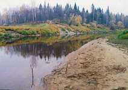

Достаточно влажный климат и равнинный рельеф, затрудняющий дренирование, объясняют наличие в районе обширной системы озёр и болот, но менее развитой речной сети. Самая крупная река области Тавда протекает с северо–запада на юго–восток района, принимая слева притоки Карабашку, Чекшанку и Ивановку, а справа Посолку, Конью, Ошмарку, Беленичную, Азанку, Каратунка, Десяткину, Билькину и Пеганку. Стоком системы озёр и болот на крайнем востоке района является речка Лайма, относящаяся к бассейну Иртыша, Тегень с притоками, берущая
начало в болотах юго-западной окраины, течёт в Туру.

Вода в реках с низкой минерализацией, чистая. Питание смешанное: являясь в основном стоками озёр и болот, реки подпитываются атмосферными осадками, грунтовыми и талыми водами. Всего в районе около 70 рек и речушек.

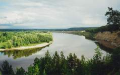

ТАВДА — левый приток Тобола. Дина 719 километров, в пределах района протекает 112. Площадь бассейна 88100 квадратных километров. Начинается при слиянии Лозьвы и Сосьвы. Наиболее значительные притоки: Пелым, Вагиль, Черная, Волчимья, Таборинка, Емельяшевка, Икса, Карабашка. Ширина в среднем до 250 метров, глубина 3-8. Течение довольно быстрое: от 0,4 до 0,8 метров в секунду. Весной сбрасывает 60% годового стока. Средний расход воды у города Тавды, в 237 километрах от устья, 462 кубометра в секунду, наибольший в паводок — 3250. Годовой размах колебаний уровня воды в реке, по данным наблюдений с 1911 года, около 5,5 метра. В половодье река в среднем поднимается на 707 сантиметров, минимум на 253. Катастрофические наводнения наблюдались в 1914 году — 924 сантиметра от межени, в 1957 — 918, в 1979 — 942. Нередки и низкие уровни, приводившие к закрытию навигации на реке: в 1980 году — 107 сантиметров, в 1988 — 97. В такие периоды глубина на перекатах не превышает 50 — 60 сантиметров. Пики подъёма воды наблюдаются с 20 мая по 20 июня, но случаются аномалии, как в недавнем 1994 году, когда высокая вода продержалась до середины сентября, а максимум её — 824 сантиметра — был 31 августа.

Замерзает река в начале ноября, вскрывается в конце апреля. Судоходна на всём протяжение с мая по октябрь. Была сплавной многие десятилетия. С 1969 года запрещён молевой сплав, позднее запрещён сплав древесины в плотах.

Течёт Тавда в широкой долине, русло её прижато к правому берегу, который иногда обрывается к реке высокими ярами, откуда открываются взору замечательные виды на водную ленту и лесное заречье. В пределах района таких яров несколько: Белый, Красный, Каратуновский, Саитковский, Васковский. В левобережной части долины хорошо выражены две надпойменные террасы. Пойма поросла ветловником и тальником, реже сосняками и березняками, достаточно богата лугами.

Реке сопутствует система озёр-стариц. Их рождение можно наблюдать а наше время. Возле села Кошуки река проложила второе русло — «прорву», образовав многокилометровый остров. Со временем одно из русел останется, а другое превратится в страницу. Крупные страницы, как Тормольская, Дощаное, Халтурино, Карабашево, Гузеево, протянулись на 6 — 10 километров.

Тавда, несмотря на продолжающееся загрязнение промышленными стоками, известна нерестилищами нельмы, сюда заходят стерлядь и сибирский осётр, всего водится более двадцати пяти рыб.

АЗАНКА — исток озера Коробейниково, течёт на восток около 50 километров до впадения в Тавду. Вначале речка заболочена, затем бежит среди смешанных лесов в неширокой долине с хорошо выраженными террасами и бровками коренных берегов. Ближе к устью реку обступают сосновые боры, пойма расширяется, появляются луговины и небольшие страницы. Вода чистая с тёмно-коричневым оттенком. В 1930-1940 годы по реке производился сплав древесины. В былые времена, до сооружения в устье очистных гидролизного завода, она изобиловала рыбой. Окрестные леса славятся грибами и ягодными местами.

Бассейн реки довольно обширен. Азанку питает дюжина небольших речек. Из Битбаевского болота на западной окраине района вытекает БАТАУШКА и через 9 километров впадает с южной стороны в Коробейниково озеро. Несколько севернее в Сарагульском болоте начинается МАЛУШКА, которая, приняв несколько ручейков, через 15 километров впадает слева в Азанку. Неподалёку свою чистую, с коричневым оттенков воду приносит ЧЕРНУШКА. Она длиной около 15 километров, вытекает из того же болота, один из её притоков имеет имя ШУМОК. Последний левый приток Азанки — БЕРЕСТЯНКА — течёт из лесов с севера, длиной 6 километров.

Из болота Щелканов Рям западнее озера Зарослое несёт красновато-бурую, насыщенную окислами болотного железа воду РЖАВЕЦ, первый правый приток Азанки длиной 17 километров. В среднем течение её пересекает автодорога на Туринск. БОЛЬШАЯ ЗЕМЛЯНАЯ появляется из болота Большая Поплавуха, принимая несколько ручьёв и небольшую речку ЧЕРНОСМОРОДИНУ, сливается у самого устья с МАЛОЙ ЗЕМЛЯНОЙ. Последняя берёт начало в Сорочьем болоте и протекает через посёлок Земляное, где в 1930-е годы на ней соорудили небольшой пруд, привлекающий к себе живописностью и чистотой. Окрестные леса постепенно оправляются от интенсивных рубок в прошлом и привлекают обилием боровой дичи и ягод. В узкой долине, поросшей елью, пихтой и кедром, бежит свои 7 километров и впадает у посёлка Карьер ЕЛОВАЯ. Последний правый приток Азанки — небольшая ЕЛОВКА, половину своего пути протекает в черте города, представляя собой цепь прудов, питающих городские усадьбы и садовые участки юго-западной окраины.

БЕЛЕНИЧНАЯ — правый приток Тавды в 6 километров дренирует участок поймы с десятком мелких стариц. В половодье все они превращаются в одно озеро, не берегу которого живописно расположена деревня Беленичное.

БИЛЬКИНКА — правый приток, берущий начало из лесных ключей к западу от села Кошуки. Половину своего 12 километрового пути течёт в слегка заболоченном логу, поросшем лесом. Выйдя к Тавде, образует с ней большой пойменный луг с вкраплением крохотных озерок. Весной он почти полностью заливается. Здесь гнездится водоплавающая птица, водится рыба: щука, окунь, язь, карась, чебак. После схода воды луг используется как пастбище.

Единственный правый приток МАЛИНОВКА начинается от северной кромки Липовского болота и принимает, в свою очередь, небольшие речки КРУТУЮ и РЕЧУХУ, на которой до 1971 года стояла деревня Липовка. В окрестностях этих речек много ягодных мест черники и земляники, водится заяц, лисица, дичь. Археологические памятники по берегам говорят о том, что они были заселены издавна. Кстати, один из вариантов перевода топонима Бильтина (устаревшее название речки) с языка манси — “Богатая ягодная река”.

ДЕСЯТКИНА — берет начало в заболоченном лесу южнее города и через 18 километров впадает справа в Тавду у деревни Ваганово. Подпитывается несколькими ручьями, на одном из которых в Святом Логу с 1920-х годов находится почитаемое местными православными верующими место, связанное с именем святого Николая Чудотворца. Пойма речки на всём протяжении представляет собой луг, поросший лесом. В среднем течении есть пруд, используемый как водопой. Недалеко от устья речка пересекается дорогой Тавда-Тюмень.

ИВАНОВКА — левый приток Тавды в месте ухода её за пределы района. Дренирует обширный участок поймы, принимая стоки небольших стариц — речки ЛУГОВУЮ и СРЕДНЮЮ, а также множество ключей и ручейков. В нижнем течении является стоком Васьковской старицы. Вода светлая чистая. До начала 1960-х годов на речке было поселение Ивановка.

КАРАБАШКА — крупный левый приток Тавды длиной 146 километров, бассейн которого около трети площади района. Берёт начало у северной границы в Кумальском болоте и впадает ниже деревни Саитково. Абсолютные отметки уровня воды: в среднем течении, при впадении в неё притока Массы — 57 метров, в устье — 46. Скорость течения 0,2 — 0,3 метра в секунду, глубина 2-3 метра.

Берега реки и её притоки издавна населены, здесь найдены археологические памятники, датируемые вторым тысячелетием до нашей эры. До 1960-х годов тут стояло ещё более десяти поселений. Сейчас их осталось три: посёлок Карабашка, деревни Мостовка и Хмелёвка. Топоним Карабашка восходит у татарскому языку и его толкуют как «черная вершина», что поддерживается тёмным цветом воды. Интересно, что главный приток носит «противоположное» название — речка Белая.

Карабашка — нерестовая река, в ней водится язь, щука, окунь, чебак, в многочисленных старичках низовий — карась и редкий линь. Образован Карабашский бобровый заказник, где завезённые из Воронежской области звери хорошо прижились. Лесные угодья и болота вокруг изобилуют всяческой живностью, ягодами и грибами. Здесь много сенокосных лугов. А прежние времена на реке стояло несколько мельниц, а в деревне Мостовке в 1930-1950-е годы действовала небольшая гидроэлектростанция. В северной частим бассейна Карабашским леспромхозом ведутся значительные заготовки древесины.

Благодаря природным богатством и красоте эта таёжная речка привлекает к себе горожан. На землях бывших деревень Покровка и Гришино появились дачные посёлки. Освоению этих мест способствуют хорошие автодороги до Мостовки и Герасимовки, пересекающие реку, а в перспективе — намеченная к строительству дорога на Конду.

Справа в Карабашку впадают притоки Татарка, Масса, Белая, слева — Малая Карабашка, Хмелёвка, Исток (Ольховка), Мостовой. ТАТАРКА — речушка длиной в 5 километров, текущая в зоне интенсивных рубок. На её берегах в первой половине века существовала деревенька — тезка. Из болот струится загадочная МАССА, принимая на своём пути в 39 километров несколько безымянных ручьёв. БЕЛАЯ в начале больше похожа на озеро-старицу: с вертолёта хорошо выделяется широкая лента речки на фоне бескрайнего чистого болота, с редкими островками грив. Вода с коричневатым светлым оттенком. Здесь водится рыба, живут бобры и норки. Особенно удивляет на редкость крупный карась.

МАЛАЯ КАРАБАШКА впадает чуть выше посёлка Карабашка. ХМЕЛЁВКА — вытекает из большого ягодного Кум байского болота, простирающегося к северу от озера Шайтанского. Вода темная, но чистая. В омутах можно выловить крупного черноспинного окуня. Пересыхающий в летнюю пору ручей МОСТОВОЙ дал название довольно большой деревне. В озеро Янычкого впадает малая болотная речушка АРЧИНКА, называемая ещё Сергинской. Несмотря на размеры, она упоминается на карте семнадцатого века Семёна Ремезова, что естественно удивляет. Или этот топоним все же относился к другому географическому объекту, или в те далёкие времена речка чем то выделялась. Может быть обилием ягодников в прилежащих болотах? Из того же озера вытекает речка ИСТОК, или ОЛЬХОВКА. Верхнее течение её проходит по заболоченной луговине, далее — по соснякам. На ней находится интереснейший археологический памятник: городище и поселение «Янычково».

КАРАТУНКА — вытекает из озера Источное на юге района и впадает в Тавду в черте города. На всём протяжении течёт в лесах, лишь в верховье пойма заболочена. Вода чистая, её химический состав не в последнюю очередь послужил причиной тому, что на речке в 1870-е годы появилась суконодельная фабрика. В старину на Каратунке стояло до пяти мельниц. Фабричная плотина держала до 1947 года большой пруд. Есть планы её восстановления и создания здесь городской зоны отдыха. Полноводности речки способствует большое количество впадающих в неё ключей, ручьёв и нескольких более крупных притоков. Это БОЛТАНКА, вытекающая из болота Малый Пуржит, и другой правый приток БОРДЯНКА, впадающий в черте городского микрорайона фанкомбината и более известный как ПЕРЕСКОК. Эта речушка течёт в глубоком, поросшем лесом овраге, в окружении доброго соснового бора.

Слева впадает ЩУЧЬЯ, исток одноимённого озера, пройдя путь в 9 километров через чащобы смешанного леса, встающего на месте когда-то безжалостно вырубленного сосняка. Чуть ниже впадает БОЛЬШАЯ МЕЖОВКА, принявшая МАЛУЮ МЕЖОВКУ у деревни Большая Пустынь, где есть пруд. Крохотная КРИВАЯ впадает у посёлка Фабрика, в неё сливается вода из минерального источника, используемого водолечебницей, и трудно определить, какой воды больше в речке — речной или подземной.

КОНЬЯ — лесная речушка длиной около 4 километров, впадающая в Тавду чуть ниже деревни Белоярка. Течёт в высоких берегах со следами древних поселений. Название с манси можно перевести как «вытекающая наружу река». Устье привлекает любителей зимней рыбалки.

ЛАЙМА — является стоком целой системы озёр: Малого и Большого Сатыковых, Тормышково, Иваново и ещё нескольких уже в пределах Тюменской области. Нерестовая. Окрестные болота известны хорошими покосами.

ОШМАРКА — образованная слиянием Большой и Малой Ошмарок, после чего через 7 километров впадает в Тавду. Очень извилиста, с расширенной поймой в старицах. Бровка коренных берегов изобилует следами жизни древних племён. БОЛЬШАЯ ОШМАРКА начинается в болоте севернее поселка Азанки и течёт около 20 километров на восток до слияния с МАЛОЙ ОШМАРКОЙ, являющейся стоком болота Зыбун. Леса вокруг интенсивно вырубались, богаты зарослями малины и смородины. На малом притоке — речке КРУТОЙ стоит одноимённая деревня, где устроен пруд.

ПАВЬЯ — протекает по северо-западной окраине района и впадает в Тавду в Таборинском районе. В неё вливается небольшая НЮКСА, текущая в лесах западнее деревни Белоярка. В 1950-1960-е годы на речке был посёлок лесозаготовителей с тем же названием.

ПЕГАНКА — начинается от слияния двух речушек ГОДОВОЧНОЙ и ЧЕРНОЙ на окраине большого Липовского болота и течёт через сплошные леса до впадения у деревни Васького. Пойма узкая, берега высокие, вокруг богатые ягодники черники и земляники. Из Липовского же болота начинается КОЧКА, текущая в пологом, местами заболоченном лесу, впадая в Пеганку слева.

ПОСОЛКА, или БЕЛОЯРКА — рождается в сосновом бору, течёт в узком овраге, живописно поросшем высокими елями. Обогнув деревню Белоярку, принимает СУЛОЙ. Это полноводная речка вместе со своими притоками КАРАБЕЙКОЙ является стоком нескольких пойменных озёр, из которых наиболее крупные Сухое, Тарта, Дикое.Посолка впадает в Тавдув красивой излучине, у кромки высокого Белого Яра. В старину расположенную на горе деревню называли Белоярская Посолка. Мансийское «посл», «посол» обозначает протоку реки.

ТЕГЕНЬ — родившись в Тегенском болоте на юго-западе района, речка принимает несколько притоков и уходит в Слободо-Туринский район. Вода чистая, с болотным оттенком и привкусом. В нерестовый период сюда приходит рыба из Туры. Зимой не промерзает. Водится норка, ондатра, в последние годы замечены бобры. По берегам сохранились кедровники, много зарослей смородины и малины. Слева впадает БИЧАЖКА и БОЛЬШАЯ КУЧАЖ, с притоком МАЛАЯ КУЧАЖ. Первые две берут начало в болоте Сенное, а третья в Каранинском болоте. Справа в Тегень впадает РЖАВЕЦ с притоком — речушкой СУХОЙ, вытекает из болота Постнинский Рям, и ниже — ИШКУЛКА.

ЧЕКШАНКА — небольшой, но достаточно полноводный приток Тавды, текущий из болота Симник ниже Тормольской старицы. Пройдя половину своего 11-километрового пути на север речка поворачивает на юг и течёт параллельно Тавде. Междуречье заслужено, богато травами. Речка нерестовая.

### Озёра

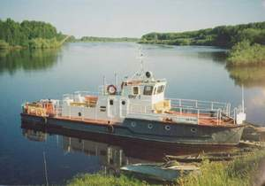

Около двухсот природных водоёмов расположено в районе: от крошечных старец до крупных верховых озёр с зеркалом в десятки квадратных километров, таких, как Большая Индра, Шайтанское, Янычково, Большое Сатыково, Носкинбаш. Особенно много озёр в левобережной части. В пойме Тавды образовались десятки стариц, иногда с площадью в сотни гектаров. Правобережные озёра междуречье Тавды и Туры отличаются круглой формой и более светлой водой. Большинство верховных озёр мелководны, в 2-3 метра глубиной, подвержены цветению и зарастанию, вод в них с тёмным торфяным оттенком и болотным привкусом. Дно илистое покрытое слоем тины (местные варианты названия: «няша», «ботка»),
достигающим нескольких метров. Нередки водоёмы, богатые отложением целебного сапропеля.

Озёра используются для водоснабжения населения. Например, водовод с Халтурино снабжает город. Богатые рыбные запасы, особенно карася, позволяют вести уловы в количестве нескольких сотен тонн в году. Как удобрение для полей, и лечебное вещество начали добывать сапропель. Некоторые озера с не заболоченными участками берегов и природными песчаными пляжами, как Карабашево, Гузеево, Халтурино, Морозко, Зарослое, имеющие хорошие подъездные дороги, стали местами отдыха тавдинцев.

АРЧИН — озеро площадью 7 га, затерянное в болоте между озерами Янычково и Шайтанское. Доступно по тропе от деревни Герасимовка. Водится мелкий карась.

БЕЗЫМЯННОЕ — озеро в бассейне Тегени, глубиной 3 метра и площадью 3 га. Водится карась. Подход по тропе от бывшей узкоколейной дороги Азанка — Каранино.

БОЛЬШАЯ ИНДРА — крупнейшее верховное озеро не только бассейна Тавды, но и всей восточной части области: в поперечнике достигает 8,5 километра, площадь зеркала 33,5 кв.км. Расположено на северной окраине района. Упоминается известным исследователем Сибири XIX века П.А. Словцовым. Абсолютная отметка уровня воды 63 метра. Вода пресная с желтоватым оттенком. В многочисленных бороздах на дне, которые рыбаки называют “золотыми ямами”, имеется глубины до 4 метров. Уловы карася могут достигать в год 300 тонн. В небольшом количестве водятся щука, окунь, чебак. Берега заболоченны, с юго — запада подступают гривы, поросшие сосной. Рыбацкий поселок расположен на западном берегу. От него к озеру через болото проложена узкоколейка для вывоза выловленной рыбы. В летнее время сюда можно добраться только авиацией, зимой — от поселка Карабашка или деревни Пальмино по зимнику.

МАЛАЯ и БОЛЬШАЯ СУИТАЛКИ — непроточные озерки в болотах междуречья Белой и Карабашки, на 9км южнее Большой Индры. Площади составляют соответственно 53 и 8 гектаров. Вода светлая с желто — зеленым оттенком. Водится карась и гольян. В окрестностях на гривах сохранились археологические памятники.

БОЛЬШОЕ и МАЛОЕ ДИКОЕ — расположены в 5-7 километрах у востоку от деревни Мостовка, между озёрами Шайтанское и Янычкого. Площади 280 и 40 гектаров. Отметка уровня Большого Дикого — 59,6 метра. Непроточные, берега заболочены. Вода с темноватым оттенком. Карась, гольян. Подъезд от Мостовки.

БОЛЬШОЕ и МАЛОЕ КАРАБАШЕВЫ — находятся в болотах крайнего севера района. Подходы затруднены. Есть карась. Площади 46 и 27 гектаров.

БОЛЬШОЕ и МАЛОЕ ОКУНЁВО — находятся в болоте Малая Поплауха, в двух километрах от озера Среднее к северо-западу. Площади 34 и 3 гектара. Доступны по тропам от Среднего
и бывшей узкоколейке из посёлка Карьер. Водится крупный, до двух килограммов, окунь. По свидетельствам рыбаков, иногда Большое Окунёво начинает «бурлить» и на его поверхность всплывают обгорелые пни и стволы деревьев. Это явление, а также большая, до 10 метров глубина, проливают свет на происхождение озера. Возможно оно образовалось при заполнении водой выгоревшего мощного торфяника. На северо-восточном берегу озера есть рыбацкая изба.

БОЛЬШОЕ и МАЛОЕ САТЫКОВЫ — располагаются в 12-14 километрах к северо-востоку от села Городище и 5-6 от Герасимовки. Отсюда же подъезды. Озёра соединены начинающейся здесь речкой Лаймой, а также мелиоративным каналом в 1980-е годы, что приводит к зарастанию русла. Площадь водозабора составляет около 300 кв. км. Площади водного зеркала: 13,1 и 4,6 кв. км. Отметки уровней: Малое — 57,8, Большое — 57,4. К берегам подступают островки заболоченного леса. Вода чистая и прозрачная, в ней водится достаточно вкусный золотой карась, а в нерест по Лайме приходит язь, окунь, чебак. На дне озера большие отложения сапропеля.

ВАГАНОВО (устаревшее название — Поганое) — находится в 13 километрах северо-западнее деревни Тагильцы. Площадь 264 га, отметка уровня 57,8 метра. Непроточное. Берега заболоченные, с ягодниками клюквы и брусники. Вода светло-желтоватая, в ней живут карась, линь, гольян. Гнездятся лебеди, гуси, утки. На южной стороне некогда стояла деревня Тумба: по старой дороге сюда можно добраться до озера сейчас.

ВАЛЬГАРСКОЕ — озерко в 6 километрах к северу от места бывшей деревни Тонкая Гривка. Татары из посёлка Эскалбы, расположенного поблизости, называют его Вончаркуль. Водится карась. Окружающие болота — пошворы богаты ягодами. Высокие гривы сохранили участки кедрачей.

ВАСЬКОВСКАЯ СТАРИЦА — названа по деревни, стоящей напротив за Тавдой, с которой она соединяется протокой и речкой Ивановкой. Известна хорошей рыбалкой, в нерест сюда заходит рыба из реки. По берегам богатые травой заливные луга.

ГАГАРЬИ — болотные озерки площадью 4 и 1 га. Одно в 2 км северо-восточнее озера Источное, другое неподалёку от Каранино.

ГЛУБОКОЕ — озеро площадью 40 га, в пойме Тавды и связанное с ней протокой. Глубина до 8 метров. На высоком западном берегу расположена база отдыха «Химик» гидролизного завода. Рядом сохранилось древнее городище. Добираются сюда по улучшенной лесной дороге от деревни Беленичное.

ГУЗЕЕВО — крупная левобережная старица Тавды, на высоком красивом берегу которой располагается село Городище. Площадь 96 га, глубина в межень до 3 метров, длина озерной подковы 6 км. В светлой чистой воде много озёрной и речной рыбы. Внутренняя пойма — сплошные покосные луга.

ДИКОЕ — озеро площадью 84 га вблизи восточной границы района в бассейне Лаймы. Водится карась и гольян. Труднодоступно. Вокруг богатые охотничьи угодья. Здесь живут лось, кабан, заяц, лиса, волк.

ДОЩАНОЕ — левобережная старица Тавды, в 5 км северо-западнее деревни Тагильцы. Подковообразной формы, длиной 5 км, площадью 69 га. В половодье сливается с текущей по северной и западной периферии речкой Исток и, через неё, с рекой. Внутри образуется большой остров. С востока в старицу впадает речушка Устинкина.

ДУХОВОЕ — озерко в бассейне Лаймы, в 3 км восточнее озера Большое Сатыково. Проточное: имеет в южной более глубокой части, протоку в Лайму. Площадь 31 га. Живет только карась.

ЕЛОВОЕ — непроточное озерко в бассейне Лаймы площадью около 10 га, среди заболоченного смешанного леса. Есть карась и гольян.

ЗАРОСЛОЕ — в 10 км от посёлка Азанка. Площадь около 100 га, глубина до 2,5 метра. С севера и с востока берега окружены сосновыми борами, от южной кромки начинаются обширные болта, богатые клюквой, брусникой, голубикой — Постнинский и Щелканов Рямы. Подвержено зарастанию: северная акватория покрыта островами. В светлой воде водится окунь и чебак. На северном берегу расположен загородный оздоровительный лагерь «Огонёк».

ИВАНОВО — проточное озеро: через него протекает Лайма. Мелкое, зарастающее. Карась мельчает. Весной заходит речная рыба. К озеру идёт дорога с твёрдым покрытием от деревни Киселево.

ИСТОЧНОЕ — самое крупное в правобережной части района, в 25 км южнее города. В озере берёт начало Каратунка. Отметка уровня воды 96,1 метра, отметка берега с восточной облесенной стороны — 99 метров. Здесь находится лесной кордон. Водится окунь, щука, язь, чебак, карась и гольян. Сюда от деревни Новосёловки идёт довольно разбитая дорога. Площадь озера 568 га.

КАБАЕВО — верховое озеро площадью 51 га в 6 км севернее деревни Тагильцы. Берега заболочены. В светлой воде живёт карась. Из озера вытекает речка Устинкина и ручей — Ржавец Мостовой.

КАЙРУКСКОЕ, или ГРИВКИНСКОЕ — озерко в болоте к востоку от Шайтанского. Площадь 22га. Зарастает камышом. Называется по имени рыбака-татарина из Эскалбов, многие годы летом жившего здесь. Второе название от близлежащей деревни. Водится карась и гольян.

КАНТЫПКА — в 4 км к востоку от посёлка Русаки. Площадь 92 га. Окружено ботами, лишь с севера прерываемым кромкой Селиверстого бора. Подход с юга по тропе от проселочной дороги Тагильцы-Русаки. Вода желтоватая, водится карась. Середина озера мелкая, здесь образовались острова, изобилующие гнездовьями уток и чаек-крачек.

КАРАБАШЕВО — левобережная старица длиной около 8 км, чуть ниже устья Карабашки. Водится речная и озёрная рыба. Внешний берег достигает значительной высоты над гладью озера и очень живописен. Здесь расположены базы отдыха «Чайка» мехзавода, дорожников и, до недавних пор, турбаза «Юность». К озеру и вокруг него хорошие дороги.

КАРАНИНО — расположена в бассейне Тегени. Площадь 270 га, отметки уровня воды 98,7 метра. Вода коричневая, в ней живут карась и довольно крупный гольян. Южный берег возвышен над болотом, на нём до 1975 года существовал посёлок, к которому приходила узкоколейка. По сохранившемуся полотну дороги можно добраться на озеро: от Азанки 45 км, от Картера — 35.

КАРАСЬЕ — непроточное, площадью 45 га, в 12 км от города, неподалеку от полотна железной дороги на Устье-Аха. Мелкое, с «ямами», где водится крупный карась.

КАРПОВО — площадью 3 га, у южной границы района в 1,5 км на юго-восток от Каранино. Вода с торфяным оттенком. Карасье. Иногда на картах и обозначается как карасье. Окружено болотом-зыбуном.

КОНДЫРЕВО — расположено на юго-восточной кромки Липовского болота, в 8 км западне Васьково. Рядом есть ещё два совсем крошечных озёрка. Все три озера часто обозначают как Кингирские. Общит их ещё очень тёмная вода и полное отсутствие рыбы.

КОНОПЛЯННОЕ или ОЗЕРО БЕЛЫХ ЛИЛИЙ — находится в правобережной пойме Тавды, в 2,5 км ниже устья Каратунки. Площадь 12 га. Берега поросли смешанным лесом с преобладанием ели. С юга подступает высокий коренной берег реки, где развивается дачный посёлок. Здесь же крошечный песчаный пляж. Водится карась, окунь, чебак.

КОРОБЕЙНИКОВО — верховое озеро, на северном возвышенном берегу которого расположен посёлок Азанка. Площадь 188 га, отметка уреза воды 62,.6 метра. Проточное: впадает Батаушка, вытекает Азанка.

КРИВОЕ — левобережная старица в черте города, подковообразно расположенное между посёлками Судоверфь и Индра. В более глубокой южной части находится пристань — база речного флота.

КУЛУХОВСКОЕ — глухое озеро на восточной окраине района площадью 7 га. Названо по деревне, существовавшей поблизости. Известно гнездовьями лебедей.

МАЛАЯ ИНДРА — находится в трёх километрах к западу от Большой Индры. Площадь 156 га, отметка уровня 61,9 метра. Карась, гольян. Труднодоступно.

МАССА — в бассейне одноимённой речки. 40 га.

МАТЮШИНО — в 7 км на северо-восток от деревни Тагильцы. 155 га., отметка уровня 54,6 метра. Берега-зыбуны и ягодные пошворы. Карасье. Подход с юга от лесовозной дороги по
гатям.

МОРОЗКО — левобережная старица длиной 6 км, пересечённая в середине железной и автомобильной дорогами. Здесь же устроен городской пляж. По внешнему берегу остатки древних
городищ.

НОСКИНБАШ, или ЭСКАЛБЫ — крупное верховое озеро площадью 2144 га, из которых только 451 принадлежит Тавдинскому району, на северо-восточной границе. Второе название от здешнего рыбацкого посёлка. Из озер вытекает Носка, приток Иртыша. Татарское «Носкинбаш» — вершина Носки. Отметка воды 64 метра. Окружено болотным массивом и доступно лишь по зимнику. Водится карась, окунь, щука, чебак; тут живёт единственное в районе стад ценой пеляди-сырка.

НЮРМА — в 3 км южнее Большой Индры. Труднодоступное. Площадь 68 га. В чистой, с лёгким коричневым оттенком воде ловится крупный карась. С южной стороны на еловой гриве стоит добротная промысловая изба коомпромхоза. Возможный перевод топонима с манси: «нур» — болото, «ма» — место,
болото.

ОКУНЁВО — в 3 км к юго-востоку от Ленино. 28 га. Водится окунь щука в небольшом количестве. Подход от дороги Тавда — Ленино. Берега заболочены.

ПАРТИ (ПАРТА) — расположено в болоте, в 6 км на восток от деревни Тормоли Первые. Площадь 68 га. Карасье. Подходы затруднены.

ПАТРИКЕЕВО — озеро площадью около 5 га в 2 км восточнее озера Янычкого. Рыбаки иногда добираются сюда по старой лесовозной дороге от Герасимовки, чтобы половить мелкий, но вкусный серебристый карась.

ПЕСЧАНОЕ — круглое верховое озеро в 82 га среди обширных болот юго-запада, в 7 км от Зарослого, откуда к нему идёт через Земляное. Глубина до 3 метров, вода прозрачная, светлая, дно песчаное. Водится щука. Украшает озеро подступивший к северо-востоку сосновый бор на высоком сухом берегу.

ПОДМЫСНОЕ — озеро площадью 9 га в Тегенском болоте. Глубиной до 3 метров, дно илистое. Занято карасём и крупным гольяном, но можно выловить щуки и чебака. Берега зыбучие, на западной стороне — пошворы с клюквой. Подход по тропе через урочище Подмысный Остров от полотна бывшей узкоколейки из Карьера.

ПУХТА — находится среди зыбунного болота в двух километрах севернее озера Тумба. 39 га. Карасье.

СВЕТЛОЕ — в междуречье Карабашки и Белой, в 5 км севернее Шайтанского. 5 га. Карасёвое. Доступно по тропе от дороги Герасимовка — Карабашка.

СЕВЕРНОЕ — затеряно в Кумбайском болоте, в 5 км севернее Шайтанского. 5 га. Карасевое. Доступно по тропе от дороги Герасимовка — Карабашка.

СРЕДНЕЕ — крупное озеро на юге, в 34 км от города. Площадь 417 га, отметка уровня воды 98,3. Берега заболочены, с запада примыкает заповедный Средненский бор. К лесному кордону ведет дорога от Источного. В светлой воде живет окунь, привлекающий любителей зимней рыбалки, а на болоте много ягод.

СТАНОВОЕ — дает начало Тегени. Площадь 20 га. Дно илистое, вода коричневая, глубина 1,5 метра. Карасевое. На южном берегу рыбацкая изба. Подход по тропе от 27 километра бывшей узкоколейки от Карьера. Название — по расположенному к югу постоянному сенокосному стану.

СУСЛЯКОВО — озеро в пойме Лаймы. Около 2 га. Водится мелкий карась. По преданию, получило название по фамилии некогда утонувшего в нем рыбака из села Городище.

ТАВЛЕЕВО — правобережная старица длинной около 5 км и площадью 25 га. В межень средняя часть пересыхает, и озеро становится похожим на разорванную подкову. По возвышенному верхнему берегу тянется цепь древних городищ. Доступно с дороги Тавда — Кошуки и от Саитково.

ТАГИЛЬСКОЕ — старица в правобережной пойме Тавды длиной более трех километров. Рядом еще множество крошечных стариц. На южном берегу расположен оздоровительный лагерь «Лесная сказка». Топоним, скорей всего, восходит к южно — мансийскому “тагил” — протока, рукав реки.

ТАЙМЕЕВО — в болоте за Средненским бором. 18 га. Крась, гольян, готовый ловится на голый крючок. Вокруг осоковые болота с хорошими покосами. Добираются сюда по тропам от кордона на Среднем, от озера Источное.

ТОРМОЛЬСКОЕ — левобережная старица с площадью 138 га. Отметка уровня 57,4 метра. Есть входная и выходная протоки в Тавду. На берегах многочисленные следы древних поселений. Речная рыба и карась.

ТОРМЫШКОВО — проточное озеро в пойме Лаймы площадью 134 га. Дно илистое, с отложениями сапропеля. Вода подвержена “цветению”. Часть приходящей на нерест рыбы остается зимовать. На берегах хорошие покосы. До 1960 — х годов здесь было подсобное хозяйство и небольшое поселение.

ТУМБА — в 15 км к северо-востоку от Тагильцев. Площадью 551 га, отметка уровня 55,9 метра. Мелкое, непроточное. Болта вокруг богаты клюквой, попадается морошка. Гладь озера выразительно оживляют острова в северной части. Отсюда и топоним: мансийское “тумп” — остров. Водится карась, линь, гольян, щука. Летом по берегам много гнездовий водоплавающей птицы.

ТЯПКИНО — озеро площадью 71 га в болтах, в 6 км западней Большой Индры. Вода с торфяным оттенком. Карась, гольян. Подход по зимнику от деревни Пальмино Таборинского района.

ХАЛТУРИНО — левобережная старица Тавды. Питьевой водоём: здесь стоит насосная станция городского водовода. Наполняемость регулируется с 1970-х годов земляной платиной на протоке, а реку у деревни Чандыри. Площадь в межень 102 га. Водится речная рыба и карась. Внешняя береговая подкова имеет песчаные пляжи и окружена зрелым сосновым бором. Тут проходит асфальтовая дорога Тавда — Тагильцы. Название, скорее всего, старица получила от фамилии рода, проживавшего в старину в Чандырях.

ЧЕБАРКУЛЬ — два озера с одинаковым названием (татарский топоним: «чыбар» — пёстрый, «куль» — озеро).

1. в 9 км восточнее Тормольской старицы площадью 159 га, с отметкой уровня 57 метров. Окружено клюквенными болотами. Карасевое. Доступ только по тропе, ведущей по гривам от дороги на Тормоли Вторые.
2. в 3 км западнее озера Янычкого площадью 109 га. Окружено сосновым бором, но береговая полоса заболочена. Карасевое. К рыбацкой избе на южном берегу ведёт лесная дорога с 17 километра трассы Тавды — Герасимовка.

ШАЙТАНСКОЕ — крупное верховое озеро в бассейне Карабашки площадью 2144 га. Абсолютная отметка уровня воды 64,9 метра. Берега сильно заболоченны, с запада подступают лиственные леса. Вода прозрачная, с голубым оттенком. Водится в большом количестве породистый карась. Гнездится водоплавающая птица: утки, гуси, лебеди, крачки, чайки. Значительные сапропелевые отложения. Дорога улучшенная от Мостовки, до города 36 км.

ЩУЧЬЕ — такое название в районе у двух озёр:

1. в 7 км южнее Большой Пустыни площадью 312 га, с отметкой уровня 97,2 метра, глубиной до 3 метров. Из него втекает река Щучье. С запада и с юга берега заболочены, северный — высокий песчаный, поросший сосной. Сюда подходит довольно разбитая лесная дорога. В светлой воде живут щука, окунь, крупный чебак.
2. на 10 км дороги в Мостовку площадью около 20 га. Водится окунь, чебак, но совершенно нет щуки. В былые годы, когда здесь стоял посёлок Щучье Озеро, насыпали пятачок песчаного пляжа, пользующегося популярностью у горожан.

ЯНЫЧКОВО — крупное озеро бассейна Карабашки, в 27 км от города. Площадь зеркала 1695 га, абсолютная отметка уровня воды 58,4 метра, глубина до 4. Берега: восточный сильно заболочен, западный высокий, увалистый, поросший лесом. Здесь расположен посёлок Лисье и звероводческое хозяйство. Озеро чистое и светлое, в нём в изобилии водится карась. Дно хранит запасы сапропеля.

### Болота

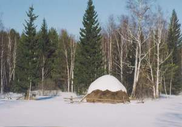

Третья часть Тавдинской земли покрыта болотами, а если прибавить переувлажнённые леса, то общая часть заболоченности района составляет чуть более половины всей его площади.

Здешние болота в основном верховые, питающиеся исключительно атмосферными осадками и не связанные с грунтовыми водами. В разрезе они напоминают линзы, пропитанные влагой, что проясняет их происхождения. Это древние озёра, заросшие в процессе революции за последние  10-12 тысяч лет. Наиболее яркие примеры: круглое болото Зыбун вблизи древни Крутое, болото Сорочье у посёлка Земляное. Зарастание продолжается и в наше время. Многие озёра окружены поясом болот, внешние контуры которых и есть границы древних водоемов.

Левобережные верховные болота района занимают сотни квадратных километров, особенно обширны они в бассейне Белой, в среднем течении Карабашки и на восточной окраине: Кумбай, Перейма, Симник, Матюшино, Спорное, Вентино и др. Водораздельные болота правобережья Липовское, Средненское, Большая и Малая Поплавухи. Щелканов и Постников Рямы, Ближнее, Тегенское, Битбаевское питают десятки речек, притоков Тавды и Туры. Многие верховные болота за тысячи лет накопили многометровые толщи растительных остатков — торфа, занимающие площади в десятки квадратных километров. Крупными торфяными болотами являются Индра, Кумбай, Лайминское, Духовое, Вентино, Шабалино, Змеиный Остров, Подъельничное.

Низинные болота встречаются в притеррасных частях речных пойм, вблизи водоёмов, реже — среди леса, где есть выходы на поверхность грунтовых вод, богатыми растворами минеральных солей. Такие болота есть в поймах Лаймы, Чекшанки, Пеганки и, конечно, Тавды.

Болота — природные хранилища воды, месторождение торфа, идущего на удобрении и топливо, местообитания редких животных и растений, источники сбора ценных ягод, места активного отдыха. Они играют значительную роль в жизни Тавдинского края.

### Почвы

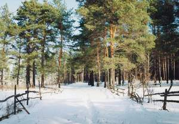

Особенности строения рельефа повлияло на почвообразовательные процессы: верхние слои морских и послеледниковых озёрных осадков на междуречных равнинах сложены охристо-бурыми суглинками мощностью 1-3 метра. Ниже они подстилаются слоями песков с примесью гальки. По механическому составу Тавдинские почвы делятся на песчаные, супесчаные, суглинистые и торфяные. Весной и осенью наблюдаются кратковременные верховодки, возникающие в песке на глубине до одного метра на суглинистыми горизонтами, что обеспечивает свежесть почв в засушливое время.

Покровные суглинки, супески и пески явились основными почвообразующими породами на межречных плато района. Здесь сформировались подзолистые и дерново-подзолистые почвы. Растущие на них хвойные леса с бедным травостоем слабо накапливают перегной, и почва бедна питательными веществами. Чем больше лиственных деревьев, богаче травостой, тем земля плодороднее. Такие почвы — серые лесные — достаточно распространены в районе.

В заболоченных лесах образуются подзолисто-болотные почвы. На низинных болотах в поймах рек появляются лугово-болотные почвы с перегнойным слоем чёрного цвета. Верховым сфагновым болотам соответствуют торфяные почвы. Тавдинские почвы типичны для южной тайги: имеют высокую кислотность, бесструктурные и не отличаются высоким плодородием. При распашки они нуждаются в известковании и удобрениях. Предпочтительней земли на приречных дренированных террасах и вдоль увалов, на серых лесных почвах.

### Растительность

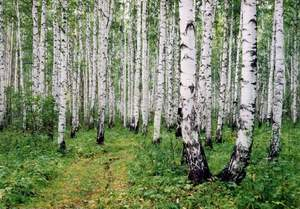

Климат благоприятствует лесной растительности Притавдинья, находящегося на окраине подзоны южной тайги. 56% территории района покрыта лесом — основным богатством края.

Кромки пойменных террас и острова реки Тавды поросли ивовыми и ветловыми лесами с подлеском из серой ольхи, черемухи, черной смородины, дерена, шиповника, встречается осокорь — черный тополь. Надпочвенный покров обжили осоки, тростники, вейник, щучка, хмель. Рядом осоковые низинные болота и заливные луга с разнотравьем лютиковых, зонтичных, злаковых — пырея, мятлика, костра, полевицы, овсяницы, лисохвоста. На повышенных местах поймы растут купальницы, тысячелетник, вероника, чина, валериана, подмаренник. Все вместе составляют богатые пастбища и покосы.

Царица наших лесов — сосна, занимающая до 40% лесопокрытой площади. Сосняками поросли обширные междуречные плато, узкими полосками они тянутся по песчаным гривам среди болот, украшают высокие яры и береговые бровки рек. Почвы здесь покрыт различными мхами и лишайниками, перемежающимися зарослями багульники, вереска, папоротника. На опушках можно увидеть хвощи, таволгу, кипрей, мединицу, кошачью лапку, сон-траву, орляка. Богатые сосновые и смешанные леса ягодниками черники, земляники, костяники. Сохранился в районе эталонный, чисто сосновый Средненский бор, не тронутый пожарами и рубкой. Чаще рядом с сосной берёза, ель, пихта, а в подлеске — рябина, липа, калина, жимолость, можжевельник, шиповник, волчье лыко, ива серая и ива козья ракита.

Более увлажненные почвы заняты тёмнохвойными лесами и лесными болотами — сограми, где с елью соседствуют пихта, кедр. Иногда лиственница. В нижнем ярусе здесь берёза, осина, малина. Растительный покров: плаун, кислица, сныть, вахта, болотная фиалка, лабазник-таволга вязолистная, другие влаголюбивые травы.

Около трёх четвертей лиственных лесов занимает неприхотливая красавица берёза (лиственные леса составляют 56%).Чистые светлые березняки украшают многие уголки района, но основные площади покрыты смешанными лесами, первыми осваивающими гари и вырубки. Тут к берёзе присоединяются осина, липа, ольха, ива древовидная, ива сибирская, тальники и, конечно, хвойные породы. В лесное разнотравье прибавляются борец, василистник, чемерица, молиния, кряжик сибирский, вех ядовитый. В березняках юго-восточнее окраины района замета примесь лугово-степных видов: клевера, люцерны, полыни, перловника.

Широколиственные породы в лесах представлены лишь липой и черёмухой, но в городских насаждениях можно встретить клён татарский и клён ясенелистный, родом из Канады. На приусадебных участках делаются успешные попытки вырастить дуб, но всё же это европейское дерево с трудом переносит местный климат. В городских скверах и садах преобладает тополь. В декоративных целях посажены акации, сирень, яблоня, черёмуха. На садовых участках культивируются различные виды плодово-ягодных деревьев и кустарников.

Верховые болота — рямы покрытые сплошным ковром сфагновых мхов, по которому растут низкорослые, в 2-4 метра, сосны, берёзы стланцевые и карликовые. В кустарниковом ярусе живут багульник, подбел, голубика, пушица, на кочках — россыпи клюквы, реже морошки, в понижениях-мочажинах растёт осока, на пошворах, по краям болот — брусника.

По берегам водоёмов обычны ирис и аир. Водную растительность представляют тростники, осоки, рогоз, хвощи. Многие мелководные озёра и старицы имеют пояс кубышек и кувшинок, в глубине, под плавающими цветами и листьями которых растут рдеста и уруть. Иногда скопление и переплетение водных растений образуют сплавины и даже плавающие острова, на которых вырастают деревья. Это явление можно наблюдать на озёрах Тумба, Зарослое, Коробейниково.

Начало изучения лесного фонда положено в 1901 году, когда были определены лесные дачи: Павья-Ошмарская, Карабашкинская, Тягенская, Коробейниковская, Сарагульская и Сборно-Еловская. Сохранился план лесонасаждений Карабашкинской дачи. Позднее лесоустройство поводилось неоднократно, и в настоящее время леса разделены на девять лесничеств, объединенных в Тавдинский лесхоз, созданный в 1947 году. Границы его совпадают с районными. Небольшая часть лесов отнесена к хозяйственное ведение колхозов и созданного в 1968 году межхозяйственного лесхоза.

Испытав интенсивные рубки в прошлом, лесной фонд всё же полностью обеспечивает нужды района и десятую часть сырьевых потребностей Тавдинского лесопромышленного узла. Расчетная лесосека, вычисленная по научно-обоснованным нормам, составляет около 250 тысяч кубометров леса в год и в 1995 году, например, была вырублена лишь наполовину.

Лес — щедрая кладовая природы. Кроме первоклассной древесины, Тавдинские леса ежегодно дают сотни тонн живицы и другого сырья для лесохимии. Сезонные биологические запасы клюквы, брусники, черники, грибов, кедрового ореха составляют тысячи тонн!

### Животный мир

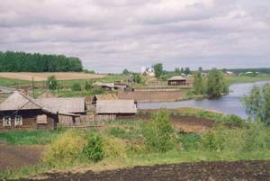

Несмотря на многократно усилившееся вмешательство человека в жизнь природы, тавдинцы ещё могут гордится богатством звериного и птичьего населения, речными и озёрными рыбами. Фауна типичная для южной тайги: у нас обитает половина видов млекопитающих из 90, представленных в сибирской тайге, около 100 видов птиц, около 30 видов рыб. Таёжная группа животных, приспособленных жить именно в хвойных лесах, представлена росомахой, бурундуком, колонком, соболем (тобольский подвид со светлой окраской меха). Наши леса входят в ареал совместного обитания соболя и куницы, где встречаются их помесь — кидус. Широко распространены также другие пушные звери: лисица, горностай, ласа, белки — обыкновенная и летяга.

Насекомоядные представлены большой группой землероек-бурозубок, кротом, ежом обыкновенным. Многочисленны грызуны: хомяк, лесная мышовка, несколько видов полёвок и мышей, серая крыса и домовая мышь. Последние два вида приспособились жить рядом с человеческим жильём. Есть несколько представителей мира летучих мышей.

Повсюду водится заяц-беляк, численность которого в иные годы достигала 20 тысяч. Ценным мехом обладает выдра, барсук, европейская норка, но они встречаются редко. Многочисленная в течение 20-25 лет ондатра стала исчезать, уступая мигрирующей из-за Урала американской норке. Численность волка в районе достигает 60-80 особей, примерно столько же рысей. В 11994 году учтено 98 бурых медведей (в год добывается 8-10 этих животных). Крупный зверь — лось обжил в основном заболоченные леса левобережной части района, его численность достигает 600 голов (в год добывают 60-80). Интересно, что ещё в 1930-е годы в район заходили дикие северные олени. Из парнокопытных водится в небольшом количестве сибирская косуля. В последние годы из Тюменской области стали проникать кабаны.

Фауна района с 1983 года обогатилась завезёнными из Воронежской области бобрами. Тогда было расселено по речкам Карабашке и Белой 16 пар и создан бобровый заказник площадью 8 тыс. га. К 1994 году насчитывалось 94 семьи — около 500 бобров. Звери, обладающие ценным мехом, обживают новые места обитания, они появились уже в верховье Каратунки. В 1993 году по лицензиям заготовлено 70 бобровых шкурок. Заготовкой пушнины, мяса других животных, сбором растительных даров леса занимается общество охотников и коопромхоз, чьи угодья составляют 320 тыс. га.

Пресмыкающие немногочисленны, что типично для таёжных лесов: гадюка обыкновенная, уж, живородящая ящерица. Из земноводных живёт травяная лягушка.

В районе много промысловой боровой дичи. По соснякам и рямовым болотам обычен глухарь, по опушкам, вблизи полей водится тетерев-косач, в ельниках, заросших логах — рябчик. Летом на озёрах в большом количестве гнездятся водоплавающие птицы и кулики. Зимой прилетает белая куропатка.

Кроме вездесущих воробьев, сорок, ворон, в лесах и полях, по речным берегам и в поселениях, рядом с человеком живёт пернатое население: скворцы, кедровки, клесты, чёрные и пёстрые дятлы, белые трясогузки, кукушки, поползни, филины, совы, ястребы-тетеревятники, ласточки, стрижи… По речке Каратунке, ближе к югу района, можно услышать соловьиные трели. Есть и другие певчие: иволга, щегол, зяблик, синица, свиристель, пеночка. Многие птицы остаются зимовать, в том числе краса заснеженного леса снегирь!

Мир насекомых тайги разнообразен: сотни видов жуков — короеды, плауны, божьи коровки, бабочек листовертки, пяденицы, капустницы, совки, перепончатокрылых — пилильщиков, муравьи, осы, пчёлы, а ещё тлей, пауков, клещей… Характерны таёжные формы — двукрылые комарики и, конечно, кровососущие насекомые — гнус: комары, мошки, пауты, слепни, мокрицы, оводы.

Тавда относится к самому богатому рыбному бассейну в Сибири, к Обь-Иртышскому. Обилие пойменные и верховых озёр, довольно полноводных нерестовых речек позволяет проживать здесь почти всех видов сибирских рыб. В Тавду заходит стерлядь и сибирский осётр (местное название — лобарь), из сиговых — нельма, из лососевых — таймень. В речках, в водоёмах, не испытывающих недостаток кислорода, водятся щука, язь, плотва (желтоглазый подвид называется чебак, а красноглазый — сорога), окунь, ёрш, налим, пескарь, линь, лещ, красноперка, елец, вьюн. Есть свидетельства о пойме в Тавде тугуна, или сосьвинской селёдки, сибирского хариуса, сома, судака.

Мелководные озёра, подверженные зимнему замору и промерзанию — царство карася, являющегося основным промысловым видом. Он представлен двумя подвидами, жёлтым и белым. Ежегодно вылавливаются сотни тонн карася. Рядом живёт гольян. Полвека назад в Тавду заходила ценная сиговая порода пелядь, или сырок.

Начиная с 1660-х годов предпринимались попытки разведения её в некоторых Тавдинских озёрах, увенчавшиеся успехом только в Носкинбаше.

### Охраняемые природные объекты

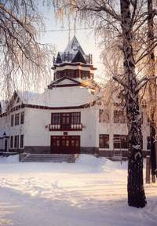

Невозможно переоценить значение в прошлом и настоящем района её лесного богатства. Без леса и его даров немыслимо было освоение края. Дерево явилось основой жилища древних рыболовов и охотников, из него рубили избы русские сельники, пришедшие в Тавду вслед казакам Ермака. Местный лес лёг шпалами в полотно великой транссибирской магистрали в конце прошлого века и в железную дорогу к Тавде в начале нынешнего. Продукция Тавдинских лесоперерабатывающих предприятий помогла ковать Победу в Отечественной войне. А как огромен мир нужных повседневных деревянных вещей, которые больно не ушибут, не встретят
неожиданным холодком, верно служат человеку многие годы.

Миллионы и миллионы кубометров древесины заготовлялись в окрестных лесах для крупного даже в масштабах страны Тавдинского лесопромышленного узла. Особенно интенсивно велись вырубки в 1940-1960-е годы, когда расчётные лесосеки значительно перерубались. Страдала тайга и от частых пожаров (в среднем это 30-50 случаев в году). Возобновлении происходило за счёт менее ценных пород, а лесовосстановительные работы велись недостаточно. Всё это привело к сокращению лесного фонда ухудшению его качества.

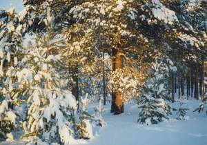

В 1958 году были заложены первые питомники, начаты лесокультурные работы. С этого времени площадь восстановительных лесов превысила 20 тысяч га. Для борьбы с лесными пожарами создана служба авиационной охраны с командой парашютистов пожарников. С 1968 года организуются школьные лесничеств (лучшее — в Карабашке), где ребята заняты сбором семян сосны, лесопосадками и уходом за питомниками.
Более жесткий контроль осуществляется за рубками, ведены ограничения лесопользования, включающие создания заказников и отнесение уникальных объектов природы к охраняемым памятникам.

КАРАБАШСКИЙ БОБРОВЫЙ ЗАКАЗНИК — определён решением областных органов власти 28 декабря 1973 года для восстановления и сохранения в естественных условиях проживания ценного пушного зверя. Площадь заказчика, расположенного в границах 200 метров от берегов Карабашки и Белой, составляет 8 тысяч гектаров. Первые 16 пар бобров, завезённых из Воронежской области, хорошо прижились,
дали потомство и стали распространятся по другим малым речкам района. С конца 1980-х годов ведётся добыча меха. Численность бобров с последние пять лет колеблется в пределах от 400 до 500 особей. Срок действия заказчика установлен до 2002 года.

СОРОЧЬЕ БОЛОТО — ландшафтный памятник природы, расположенных в двух километрах к юго-западу от посёлка земляное. Это типичное водораздельное сосново-сфаговое болото площадью 529 га, в котором берут начало речки Малая Земляная, Кривая, Еловая. Тут растёт клюква, брусника, голубика. Отличается болото экологической чистотой, имеет природную и научную ценность. Ботанический памятник областного значения с 1983 года охраняется законом.

СРЕДНЕНСКИЙ БОР — уникальный сосновый лес, тянущийся узкой полоской между озёрами Среднее и Источное. С 1983 года отнесён к охраняемым ландшафтным памятникам областного значения. В территорию единого озёрно-болотно-лесного комплекса, типичного для подзоны южной тайги, вошли 795 га заповедного, уцелевшего от рубок и пожаров, соснового бора, а также озеро Среднее, Источное, Щучье, Таймеево с окружающими лесами и болотами, всего 8209 га. Бор состоит из прекрасных корабельных сосен. Озёра — место гнездования многочисленных водоплавающих птиц, включая лебедей. Рыбная ловля здесь ограничена. Болота сохранили разнообразную флору и фауну. В заповедник запрещена всякая хозяйственная деятельность, заготовка ягод и лекарственных трав, охота, то есть всё, что может ухудшить состояние природной среды и ландшафтов.

Десятая часть всех лесов района отнесена к группе, имеющей важное защитное и водорегулирующие значение. Все водоём и реки имеют береговую водо-охранную зону шириной от 100 до 500 метров. Большая часть промышленных и коммуникальных стоков проходит через отчисные сооружения фанерного комбината и гидролизного завода. Уже четверть века нет молевого сплава, недавно запрещён сплав древесины в плотах. Благодаря этим мерам, а также тому обстоятельству, что с начала 1990-х годов произошел спад производства на городских предприятиях, вредные загрязняющие сбросы в Тавду сократились. Это положительно сказалось на самочувствии главной водной артерии края. В реке прибавилось рыбы, реже происходят зимние заморы.

Все приезжающие в Тавду отмечают частоту воздуха, наполненного живительным ароматом хвои. Сокращение вредных выбросов в атмосферу и бережное сохранение зелёного пояса вокруг города — вот причины этого отрадного явления. Нелишним будет заметить, что и радиационный фон в районе не превышает 12-13 микрорентген в час, что в пределах нормы. За экологической ситуацией с 1976 года следит гидрохимическая лаборатория межрайонного комитета по охране природы, расквартированная в нашем городе.

Природа подарила тавдинцам благодарную землю. Веками многообразный природный комплекс обеспечивает жителей края пропитанием и кровом, наполняет их жизнь красотой. Бережное использование и сохранение природных ресурсов всё более становится для них важнейшей нравственной обязанностью.
