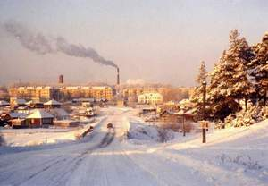

Валерий ЕРМОЛАЕВ — автор поэтических книг, его стихи вошли в «Антологию цеха поэтов», изданную в 1995 году в Екатеринбурге; он искусствовед — закончил Академию художеств в Санкт-Петербурге и многие годы изучает народное деревянное зодчество Зауралья, а в родной Тавде известен ещё и как автор краеведческих очерков.
***
Тавдинский район Свердловской области расположен в среднем течении реки Тавды, притока Тобола, в лесном Зауралье, на западной окраине одной из самых обширных низменностей земного шара — Западно-Сибирской равнины. Левобережная половина территории района входит в восточную провинцию Кондинской низменности, а правобережная — междуречье Тавды и Туры — захватывает часть Зауральской наклонной равнины.

Район занимает площадь 6539 квадратных километров, из них около 3100 — леса, 2500 — болота, 175 — озера и реки, 442 — сельскохозяйственные угодья. Центр района город Тавда расположен в 360 километрах к востоку от Екатеринбурга и в 125 километрах к северу от Тюмени. Географические координаты его: 65 градусов 16 минут восточной долготы и 58 градусов 03 минуты северной широты. Город занимает площадь в 160 квадратных километров, из них 45 под застройкой.

Протяженность района в широтном направлении 93 километра, в меридиальном — 110. Занимая крайне восточное положение в области, он граничит на севере с Таборинским, на западе с Туринским, на юго-западе с Слободо-Туринским районами. С северо-востока примыкают Кондинский, с востока — Тобольский, с юга — Нижне-Тавдинский районы Тюменской области.

После присоединения Сибири к Руси с конца 16 века тавдинские земли входили в состав Пелымского воеводства, затем Тобольского, а с учреждением губерний в 1708 году — в Кошукскую волость Туринского уезда Сибирской губернии, с 1796 года ставшей Тобольской, в свою очередь переименованной в августе 1919 года в Тюменскую. В ноябре 1923 года образованный район с центром в посёлке Тавда в составе Ирбитского округа Уральской области, при разделении которой в январе 1934 года Верхне-Тавдинский район отнесён к Обь-Иртышской области, вскоре переименованной в Омскую. В октябре 1938 года Тавдинский район отошёл к Свердловской области.
