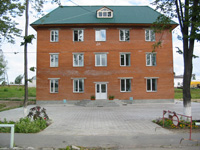
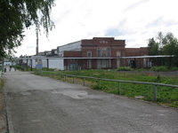
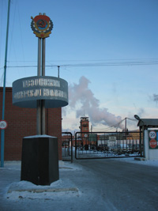

## История Тавдинского фанерного комбината

История Тавдинского фанерного комбината начинает отсчет с 22 июля. В этот день, месяц спустя после начала Великой Отечественной войны, комбинат выдал первую продукцию — древесно-слоистый пластик ДСП-10 и первые кубометры авиафанеры.

В военные годы продукция комбината была ориентирована на заказы наркоматов авиационной промышленности, боеприпасов и вооружений, производя в период с 1941 года по 1945 год 20 видов продукции.

Коллектив предприятия успешно справлялся с поставленными перед ними задачами, ежегодно наращивая объемы выпуска продукции.

В 1942,1943 и 1944 годах коллектив комбината завоевывал Переходящее Красное знамя Наркомлеса СССР и ВЦСПС. Переходящее знамя Государственного Комитета Обороны впервые комбинату было присуждено в 1943 году, затем дважды в 1944, а в 1945 году ежеквартально.

Год 1945 для коллектива предприятия стал годом трудовых достижений, на много опередивший по результатам своего труда все фанерные предприятия.

Произведено 24489 куб. метров фанеры, 5775 куб. метров авиафанеры (131% к плану), 889 куб. метров авиашпона, 1550 тонн древесно-слоистого пластика ДСП-10 (115% к плану). Более чем вдвое перевыполнены задания по монолитным шарам и кубикам, погонялкам. Сверх задания выпущено 359 куб. метров бакелизированной фанеры.

19 апреля 1946 года ВЦСПС и министерство лесной промышленности СССР за самоотверженный труд коллектива рабочих и служащих в период Великой Отечественной войны 1941-1945 г. г. вручают фанерному комбинату на постоянное хранение Красное знамя Государственного Комитета Обороны, которое присуждалось в годы войны победителям во Всесоюзном социалистическом соревновании.

Более 700 человек Указом Президиума Верховного Совета СССР от июня 1945 года награждаются медалью «За доблестный труд в Великой Отечественной войне 1941 — 1945 г. г.»

В после военное время постепенно сокращается выпуск продукции военного назначения и увеличивается объем продукции для восстановления народного хозяйства. Комбинат приступает к производству товаров народного потребления. Комбинат ставит перед собой новые цели:

* увеличение объема выпуска продукции;
* выпуск фанеры на экспорт;
* сокращение применения ручного труда;
* изготовление новых видов продукции.

Комбинату устанавливается план жилищного строительства. Коллектив предприятия успешно справляется с поставленными задачами. Указом от 17 сентября 1966 года Президиума Верховного Совета СССР за досрочное выполнение семилетнего плана и успешное осуществление механизации производства комбинат награждается орденом Трудового Красного Знамени. Комбинат продолжает работу по строительству новых промышленных площадей, расширяет существующие.

В 1965 — 1967 г. г. идет строительство очистных сооружений, которые примут все городские стоки. В 1967 году завершено строительство цеха древесно-стружечных плит. 15 ноября 1967 года из пресса ПР — 6 А вышли первые древесно-стружечные плиты.

Происходит замена устаревшего оборудования на более совершенное и высокопроизводительное. Парк лущильных станков заменен финскими станками Rau — te, появились газовые сушилки СРГ — 25, механизируется процесс сборки пакетов фанеры.

17 октября 1974 года комбинат выработал юбилейный 2-х миллионный кубометр фанеры. Право выработать юбилейный кубометр фанеры завоевала бригада Героя Социалистического труда — Савостьяновой Раисы Петровны.

В 1975 году комбинат достиг максимальной годовой выработки фанеры 87443 куб. метра.

Продолжается работа по дальнейшей механизации трудоемких процессов, совершенствованию технологического процесса.

В цехе сырья и топлива появляются краны оснащенные грейферными захватами, строятся бассейны для гидротермической обработки фанерного сырья, на разделке фанерного сырья появляются полуавтоматические пилы. В лущильном цехе идет замена парка лущильных станков. Монтируются и сдаются в эксплуатацию паровые котлы.

В сентябре 1988 года комбинат перешагнул рубеж 3-х миллионов кубометров фанеры. Государство высоко оценило труд Тавдинских фанерщиков. Более 100 человек были награждены в послевоенное время орденами к медалям СССР. Пять человек удостоены высшей награды СССР — ордена Ленина.

В 1992 — 1994 года предприятие вступило в период приватизации, а затем акционирования. Комбинат преобразован в акционерное общество открытого типа и стал называться АООТ «Тавдинский фанерный комбинат».

В течении 1995 — 2002 годов происходит неоднократная смена правовой формы собственности предприятия. Происходит спад производства.

В 1998 году рекордно низкая производительность предприятия. В июне 2002 года на предприятие приходит новый собственник. Берется направление на вскрытие и использование всех резервов производства, на совершенствование организации труда и укрепление трудовой дисциплины. Растет объем выпуска фанеры.

В 2006 году он достиг 52 тысяч кубических метров фанеры. В этом же 2006 году пущен в эксплуатацию цех по производству гнуто-клееных изделий.

В 2007 году произведена реконструкция цеха древесно-стружечных плит. Поставлена задача выпуска ламинированных плит.

Несмотря на имеющиеся трудности, комбинат наращивает объемы выпуска продукции, занимается совершенствованием технологического процесса, идет по пути снижения затрат.

Источник: [Сайт Тавдинского фанерно-плитного комбината](https://www.tavda.ru/index.php?option=com_content&view=article&id=10&Itemid=102&lang=ru).
