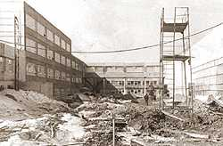
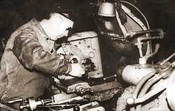
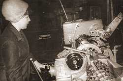
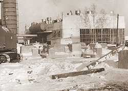
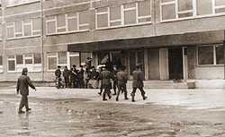
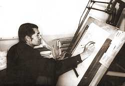
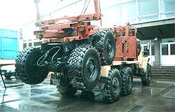

## История Тавдинского механического завода

**1947 год.** В апреле 1947 года, на базе механических мастерских Главпромстроя НКВД, был организован Тавдинский механический завод.

Завод изначально был ориентирован на производство прицепов для нужд лесозаготовительной промышленности. Первой его продукцией стали узкоколейные вагонетки конной тяги для вывозки леса из лесосек.

**1949 год.** Начало выпуска лесовозных прицепов модели 1-АП-5, грузоподъёмностью 5 тонн. Конструкция рамы, коника, дышла была выполнена из деревянных брусьев, соединённых болтами и скобами. Начинается строительство зданий механического и заготовительных цехов. Открывается инструментальный цех, сдаются конструкторский и технологический отдел.

**1952 год.** В августе 1952 года разработан и применён  поточный метод сборки.

**1954 год.** В сотрудничестве с Центральным научно-исследовательским институтом механизации и электрификации лесной промышленности (ЦНИИМЭ) в 1954 году на заводе внедряется двухосный автоприцеп марки 2-ПР-10Х грузоподъёмностью 10 тонн, предназначенный для перевозки леса в хлыстах. Это была металлическая сварная конструкция, и её внедрение потребовало новой организации производства, коренного изменения технологии.

**1956 год.** Согласно постановлению ЦК КПСС и Совета Министров СССР завод был передан в Министерство автомобильной промышленности, что положительно сказалось на его развитии. Постоянно растущая потребность в автоприцепах обязывала завод  увеличивать производственные площади, расширять жилой фонд, наращивать и обновлять станочный парк, пересматривать технологию, внедрять передовые современные методы производства. В 1956 году был построен корпус механосборочного цеха с кузнечно-прессовым отделением общей площадью 3168 м².

**1957-1959 года.** Созданы прицепы-роспуски модели 2-Р-8 и 2-Р-15 грузоподъёмностью 8 и 15 тонн соответственно.

**1960 год.** Создан собственный конструкторский отдел. Разрабатываются новые модели прицепов: ТМЗ-802А грузоподъёмностью 8 тонн и ТМЗ-803А грузоподъёмностью 15 тонн, имеющих тормозную систему и складывающееся дышло. Также разработаны полуприцепы для перевозки ферм длинной до 30 метров, для перевозки железобетонных изделий весом до 25 тонн, и ряд других изделий.

**1962 год.** «Тавдинский механический завод» становится головным предприятием Минавтопрома по производству автоприцепов для перевозки леса моделей ТМЗ-802А и ТМЗ-803А.

**1966 год.** Заместитель министра автомобильной промышленности утверждает задание на реконструкцию завода с вводом нового корпуса площадью 20000 м² с новой котельной и мазутохранилищем, зданиями заводоуправления, ремонтно-инструментального корпуса с бытовыми помещениями, расширением жилого микрорайона. **К 1975 году** новый корпус был сдан  и пущен в эксплуатацию, а **в 1978 году** генеральная реконструкция была завешена.

**1974 год.** Начато производство двухосных тормозных автоприцепов сварной конструкции грузоподъёмностью 15 тонн.

Тесная работа с ЦНИИМЭ — ведущим институтом Министерства лесной промышленности, в частности с лабораторией под началом доктора технических наук Горбачевского, позволила разработать и применить массу передовых на тот день технических решений. Например, начать производство крестообразной сцепки — устройства, позволяющего управлять роспуском с такой точностью, что при повороте колея прицепа совпадает с колеёй тягача. На базе МАЗ-509А и КрАЗ-255Л воплощена идея погрузки роспуска на тягач при холостом пробеге.

**1976 год.** Освоен роспуск 9383, грузоподъёмностью 15 тонн.

**1980 год.** Роспуск 9383 модернизируется по результатам испытаний и мероприятий двух министерств автомобильной и лесной промышленности. Запущен в производство лесовозный прицеп-роспуск 9362, более совершенной конструкции, к тягачам МАЗ-5434 и КрАЗ-6437.

**1983 год.** Заводу передано производство спецтехники для комплектации Министерства  обороны: шасси МАЗ-5310, прицепы модели ГКБ-83011.

Уже в 1985 году было произведено 600 штук МАЗ-5310 и 1000 штук ГКБ-83011, полностью соответствующих повышенным требованиям военной приёмки Министерства обороны.

**1990 год.** Перед самым распадом СССР было проведено техническое перевооружение основного производства, результатом которого стало внедрение металлорежущих станков с числовым программным управлением, линии механической обработки ступицы с тормозным барабанным механизмом, повышение технического уровня производства.

**1990 год.** Совместно с чехословацким заводом «Татра» проведены сравнительные испытания роспусков Татры и ТМЗ. Роспуск ТМЗ показал лучшую характеристику и был адаптирован к тягачу «Татра».

**1992 год.** Распад Союза сделал тягачи КрАЗа и МАЗа импортной техникой, и уже в 1992 году ТМЗ выпустил первые пять штук лесовозных прицепов-роспусков ГКБ-9851 штатных для УРАЛА-43204-31, а на следующий год их было произведено уже 406 штук.

**1993 год.** Разработке целой серии прицепов и полуприцепов сортиментовозов способствовало внедрение новой технологии лесозаготовительных работ, то есть потребность в транспортных перевозках сортимента. На заводе создан и внедрен в производство двухосный прицеп-сортиментовоз ТМЗ-8666, грузоподъёмностью 15 тонн, предназначенный для перевозки леса в сортиментах длиной до 6 метров.

**1994 год.** Появляется в производстве автопоезд-труболесовоз ГКБ-6019, предназначенный для перевозки с самостоятельной погрузкой и разгрузкой труб длинной 12 метров и леса в хлыстах длинной 17-23 метра, а также  автопоезд трубоплетевозный модели 6021 для перевозки труб до 36 метров, грузоподъёмностью 14 тонн. Уже на следующий год произведено 28 автопоездов-труболесовозов, которые затем попали в Башнефть, Ноябрьскнефтегаз, Нижневартовскнефтегаз, Пермьнефть, Сургутгазпром.

Конструкция автопоезда, в процессе эксплуатации зарекомендовала себя положительно.

**1995 год.** Разработана техническая документация и созданы опытные образцы труболесовозных автопоездов, с механизмом, обеспечивающим загрузку длинномерных грузов на две стороны, на базе автомобильных шасси КАМАЗ-43101, УРАЛ-4320, ЗИЛ-131 и автоприцепы на базе роспуска ГКБ-9851. Также другие надстройки и прицепы адаптированы под КАМАЗ.

**1996-1999 года.** Кризис, охвативший экономику и отрасль в целом, не мог не затронуть предприятие. 1996-1998 годы, годы кризиса для Тавдинского механического завода. К заводу применяется процедура банкротства, и в октябре 1998 года на заводе вводится процедура внешнего управления. В основу плана внешнего управления закладывается опора на собственные силы, потенциал коллектива. Восстанавливается система прямых продаж продукции завода предприятиям лесного комплекса, Тавдинский механический завод, участвуя в отраслевых выставках, начинает реагировать на современные технологии лесовывозки. Расширяется номенклатура выпускаемых изделий. Значительное внимание уделяется реанимации системы снабжения — предпочтение отдаётся прямым закупкам с предприятий поставщиков. К периоду завершения процедуры внешнего управления удалось восстановить
собственные оборотные средства, комплектные запасы материально-технических ценностей. За период внешнего управления завод полностью рассчитался с задолженностью по заработной плате, накопленной в предыдущие годы,
обеспечил все текущие платежи в бюджеты всех уровней и внебюджетные фонды. По результатам инвентаризации оптимизирован состав основных фондов, в том числе парк оборудования в технологических процессах. В соответствии с планом внешнего управления в декабре 1999 года основной бизнес из состава ГУП «Тавдинский механический завод» продан на конкурсной основе с инвестиционными условиями и создано
новое юридическое лицо — ООО «Тавдинский механический завод».

**1999 год.** Конкретным результатом участия в межрегиональной выставке-ярмарке «Лесной комплекс — 1999» стал автомобильный самосвальный полуприцеп-щеповоз с гидрофицированной разгрузкой через задний борт модели 9308-10 для перевозки древесной щепы и объёмных сыпучих грузов. Потребность в данном изделии высказали в ходе дискуссии на выставке целый ряд участников. Совместно с ОАО «Свердлеспром» было проведено технико-экономическое обоснование применения автопоезда-щеповоза, подтвердившее  высокую эффективность его эксплуатации по сравнению с железнодорожным транспортом. Изделие получилось весьма конкурентоспособным как по техническим характеристикам, так и по цене и на сегодня пользуется стабильным спросом.

**1999 год.** В апреле 1999 года, в результате переговоров с АО «Пан-Моторс» — официальным продавцом автомобилей SISU в России, было достигнуто соглашение о создании совместного автопоезда сортиментовоза, а уже в начале декабря того же года трёхосный полуприцеп модели 93071-010 впервые был продемонстрирован на второй всероссийской выставке-ярмарке «Российский лес — 2000» в г.Вологда, где был сразу приобретён и успешно эксплуатируется. Из-за высоких цен реально SISU лесовоз не нашёл массового покупателя в России, поэтому полуприцеп адаптировали с российскими тягачами, имеющими высоту седельного устройства 1300 мм.

**1999 год.** Начато производство тяжеловозных полуприцепов — тралов. Многолетний выпуск прицепов-роспусков позволил довести конструкцию осей, пригодных под комплектацию тралов. Первые тралы были ориентированы для перевозки  гусеничной техники лесного хозяйства. Снижение объёмов производства у предприятий производящих аналогичную продукцию, стабильный интерес других отраслей народного хозяйства, так же испытывающих дефицит тралов, заставило завод активно осваивать новые для себя изделия. Инженерные службы завода сработали оперативно и начато производство целой серии тяжеловозных полуприцепов с высокой и низкой рамой, а также тралов с подкатной тележкой.

Особенностью производства тралов, как и сортиментовозной группы является внесение конструктивных изменений по заявкам потребителей.

**2000 год.** Завод, преодолев кризис, уверенно набирает силу. В 2000 году обеспечен прирост товарной продукции по сравнению с 1999 годом на 56,4%. Потребителям отгружено 484 единицы прицепов-роспусков под тягачи-лесовозы Урал, КрАЗ, МАЗ, КАМАЗ. Отправлены потребителям в 16 регионов России более 50 единиц тяжеловозных полуприцепов «тралов». Для «Сургутнефтегаза», «Юкоса», «Славнефти», «Лукойла» изготовлены на базе шасси автомобилей УРАЛ и КАМАЗ 72 единицы трубовозов с электромеханизированной разгрузкой и плетевозов.

В течение года «Тавдинский механический завод» принял участие во Всероссийских и отраслевых выставках, таких как «Российский лес 2000» в г. Вологда, «Лесной комплекс 2000» в г. Екатеринбурге и других. Техника завода неоднократно отмечалась дипломами и почётными грамотами. В октябре на заводе прошла первая потребительская конференция.

**2003 год.** В связи с расширением сферы деятельности ООО «Тавдинский механический завод» с 1 августа 2003г. образовано новое юридическое лицо ООО «Тавдинский машиностроительный завод». К новому предприятию перешли все полномочия по изготовлению и реализации прицепной техники, а так же права, обязанности и гарантии по ранее заключенным договорам с ООО «Тавдинский механический завод».

**2009 год.** ООО «Тавдинский машиностроительный завод» признано несостоятельным (банкротом), открыто конкурсное производство. Конкурсный управляющий — Легалов Владимир Александрович.

<!-- Далее архивные записи, которые были на сайте предприятия в 2000-х годах. Если нашли эту пасхалку, напишите мне по адресу fsa@tavda.info ;-)

На сегодняшний день ООО «Тавдинский машиностроительный завод» — это стабильно работающее предприятие, выпускающее широкую гамму надёжной, проверенной годами прицепной техники, способной удовлетворить любые запросы потребителей.

Собственный конструкторский отдел позволяет оперативно решать технические согласования с заказчиком по внесению изменений в конструкцию выпускаемой техники, а технологическая вооружённость и обеспеченность нормативными запасами материальных ресурсов и комплектующих, позволяют оперативно исполнять индивидуальные заказы, в том числе и на тяжеловозные прицепы «тралы». Срок исполнения 30 календарных дней с момента заключения договора, при достижении 90 календарных дней на аналогичную продукцию у других производителей.

Гибкость производства, и как следствие большая гамма выпускаемой продукции; повышенное внимание к качеству — вся продукция сертифицирована, при приёмке к продукции предъявляются жёсткие требования ОТК; оптимальные цены; экономия ж.д. тарифа за счёт применения уплотнённой схемы погрузки; индивидуальная работа с каждым заказчиком — всё это позволяет заводу не только выжить, но и динамично развиваться. Завод уверенно смотрит в завтрашний день и предлагает каждому долгосрочное, взаимовыгодное сотрудничество.

ООО «Тавдинский машиностроительный завод» постоянно участвует в различных выставках и выставках-ярмарках, проводимых в крупных центрах Российской Федерации. Продукция завода была неоднократно отмечена благодарственными грамотами и дипломами.

-->
